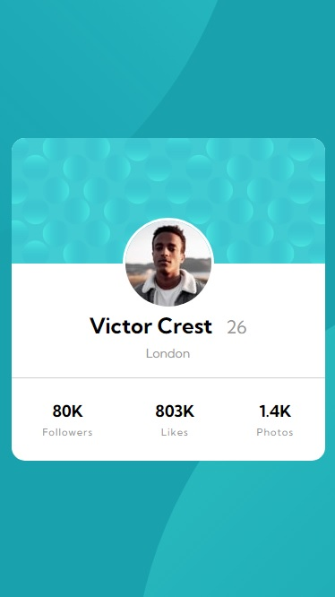

# Frontend Mentor - Profile card component solution

This is a solution to the [Profile card component challenge on Frontend Mentor](https://www.frontendmentor.io/challenges/profile-card-component-cfArpWshJ). Frontend Mentor challenges help you improve your coding skills by building realistic projects. 

## Table of contents

- [Overview](#overview)
  - [Screenshot](#screenshot)
  - [Links](#links)
- [My process](#my-process)
  - [Built with](#built-with)
  - [What I learned](#what-i-learned)
  - [Continued development](#continued-development)
  - [Useful resources](#useful-resources)
- [Author](#author)

## Overview

### Screenshot




### Links

- Solution URL: [Add solution URL here](https://your-solution-url.com)
- Live Site URL: [Add live site URL here](https://your-live-site-url.com)

## My process

### Built with

- Semantic HTML5 markup
- CSS custom properties
- Flexbox
- CSS Grid
- Mobile-first workflow

### What I learned

In this project, I learned (although I don't fully understand yet) how positioning works in flex. Additionally, it took me the most time to sort out the issue regarding the hover in the image (I still see the problem with the opacity img hover). The rest seemed understandable by the previous challenge I made.

To see how you can add code snippets, see below:

```html

  <div class="bg__top">
    
  </div>

  <div class="bg__bottom">
    
  </div>

```
```css

.test {
    position: relative;
    display: flex;
    justify-content: center;
}

.user__avatar {
    border-radius: 50%;
    border: 3px solid white;
    position: absolute;
    top: -55px;
    margin: 0;
    padding: 0;
}
.user__info {
    display: flex;
    align-items: baseline;
    justify-content: center;
    margin-top: 50px;
    margin-bottom: 7px;
}

```

### Continued development

In the future, I definitely want to focus on learning exactly how to create components according to imposed rules. Everything always comes back in my head to the fact that somewhere someone invented some rule of creating websites and I create as it seems to me (the effect can be seen in the project)

### Useful resources

- [Aligning Items in a Flex Container](https://developer.mozilla.org/en-US/docs/Web/CSS/CSS_Flexible_Box_Layout/Aligning_Items_in_a_Flex_Container) - As I mentioned earlier on MDN you can very quickly find out about any element you are interested in when creating a page.
- [CSS @media Rule](https://www.w3schools.com/cssref/css3_pr_mediaquery.asp) - This is an amazing article that helped me finally understand media query. I recommend it to anyone who is still learning this concept.
- [Breakpoint Rules](https://dev.to/sobhandash/media-queries-and-breakpoints-2022-4gkm)
- [Image Hover Overlay](https://www.w3schools.com/howto/howto_css_image_overlay.asp)

## Author

- Website - [PiotrekZie](https://piotrekzie.github.io/zielonsky-web/)
- LinkedIn - [/in/piotr-zielinskii](https://www.linkedin.com/in/piotr-zielinskii/)